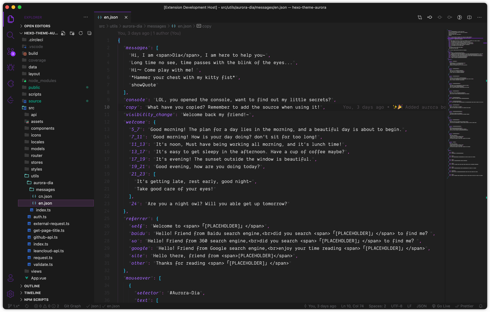

# Aurora Future

> This theme is inspired by 💀 Adam Argyle's [Kung-Fury-Theme](https://github.com/argyleink/Kung-Fury-Theme).

**Purple**, **pink** and **blue** are the main colors of this theme. These colors combine give us a futuristic feel. The color scheme is inspired by Adam Argyle's theme.

However I have change the colors, to follow the colors used in `Auroral-UI`, basically the same colors used in my [Hexo Theme Aurora](https://github.com/auroral-ui/hexo-theme-aurora).

## Why make this theme?

First is because I fall in love with Adam Argyle's sublime3 theme when I watched his Youtube videos. The syntax highlight he did is just pure awesomeness, but his VSCode's version of the theme is very outdated, also the color saturation is just a bit too high for my own liking, therefore I decided to make my own base on his ideas. Another thing is that I would like to have my own custom theme to go with my Auroral-UI project.

I have used many themes in VSCode, but most of them used way too many colors. After writing hours of codes, my eyes gets very tiring of looking at those colors.

Therefore the main goal of this theme is to use the main colors of Auroral-UI and draw back all the distractions from the colors. Which help us focus on what is important and keep the visual harmony in the theme.

## Features

> I follow the same goals as Adam Argyle's sublime3 theme, because I couldn't agree more on his design concepts.

- **Accentuates the signal** of your code, while pushing back the noise
- Colors, italics, and subdued colors are meaningful to help you understand the code via consistent coloring, there's rhyme and reason for the choices beyond visual harmony
- If your code has no errors, then it looks pythonic (noise reduction)
- Dark mode that's been tested heavily for day and night use
- Leverages cursive if you're using [Dank Mono]() or [Operator Mono]()

## Recommended combination

- **Font**: use **Dank Mono** or **Operator Mono**
- **Icon theme**: Material Theme Icon Dark

## Screenshots

### JavaScript

### Vue

### Vue-HTML

### Json

### Yaml

